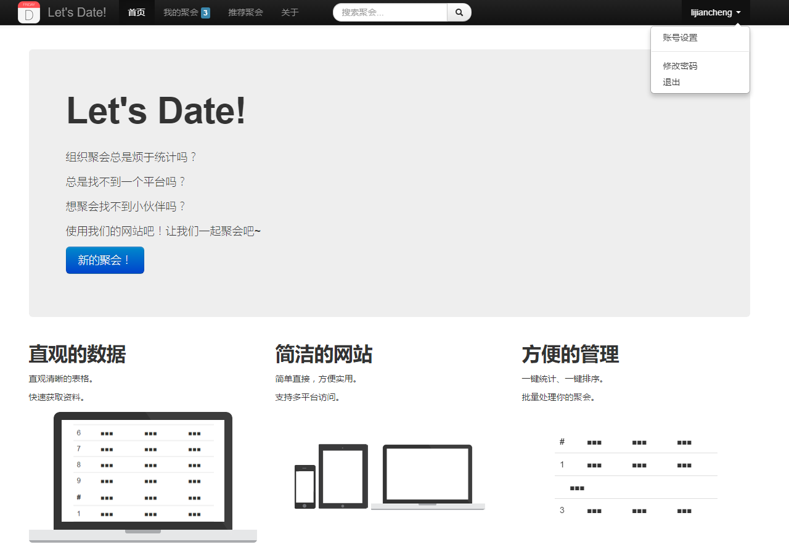
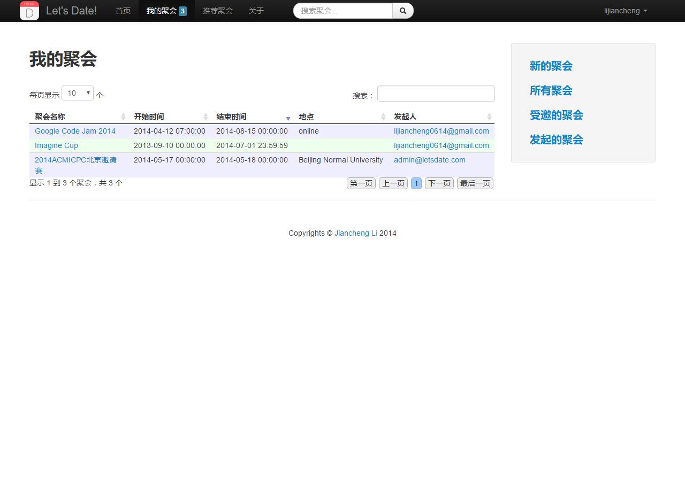
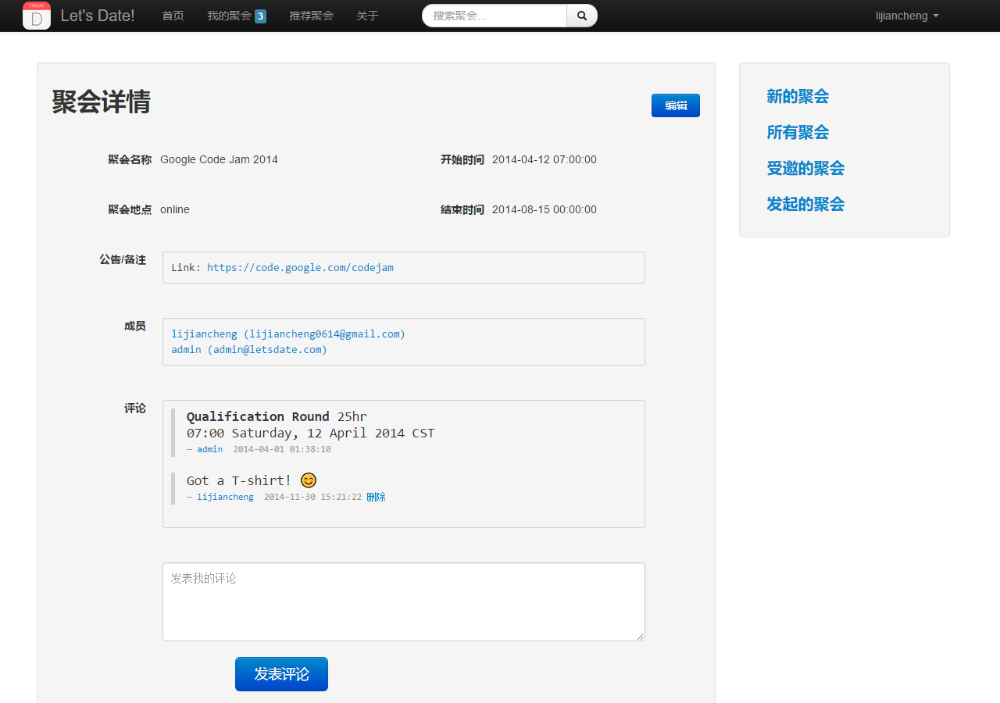
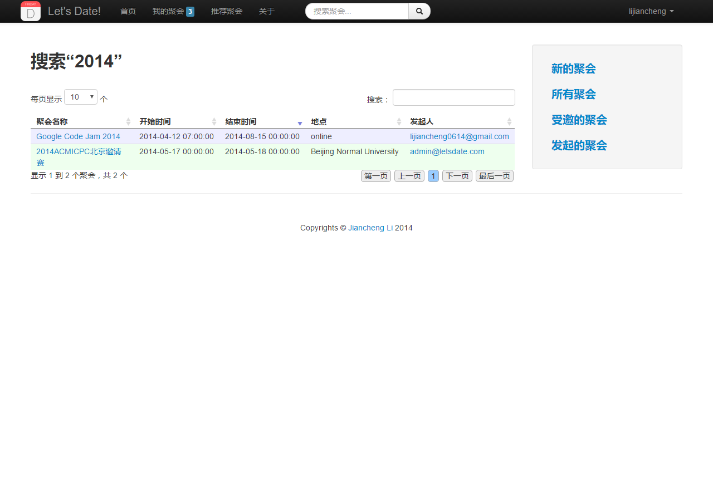
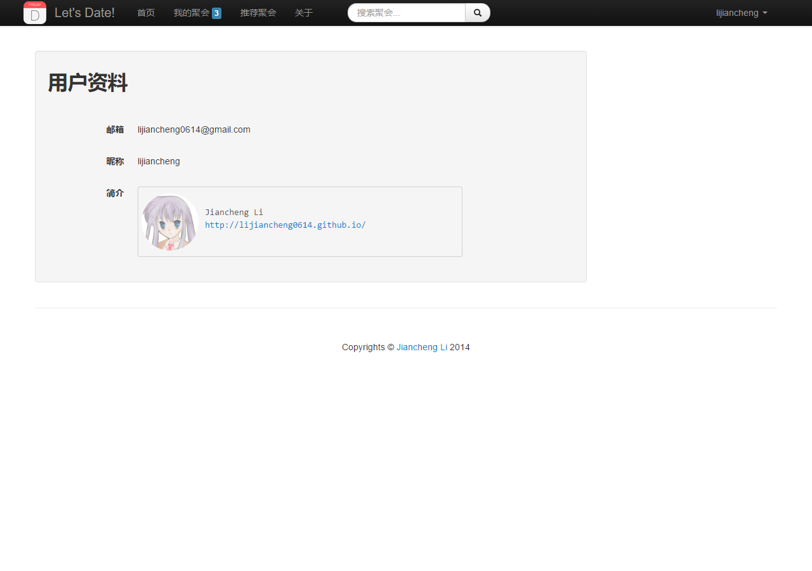

# Let's Date!

一个管理聚会、会议及其它活动的网站。

## 演示地址

https://letsdate-lijiancheng0614.appspot.com/

## 网站理念

Let's Date主要面向经常需要管理聚会、会议、约会等人群。

整个网站简单直接，方便实用，这将是我们不懈的追求。

## 部署

环境要求：PHP + SQL

1. 初始化SQL

    使用`legacy/init.sql`初始化SQL，修改`include/db.php`中的MySQL配置。

2. 运行PHP

    首页为`index.php`。

## 运行截图

